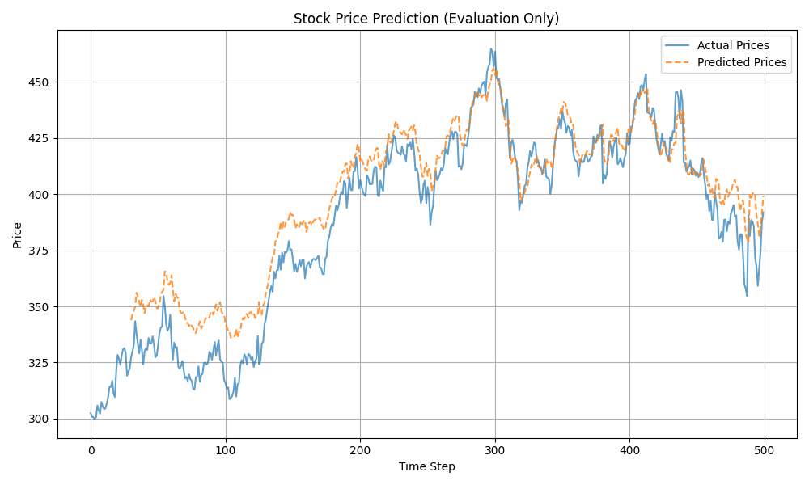

# Clear LSTM Implementation

## Overview

Welcome to the third part of the "clear_neural_networks" series! This directory provides a clear, step-by-step implementation of a **Long Short-Term Memory (LSTM)** network from scratch using only **NumPy**. Building upon the concepts introduced in the vanilla RNN implementation, this LSTM aims to be an educational resource for understanding its internal mechanics without the abstraction of high-level deep learning frameworks.

I focus on explaining the forward pass, Backpropagation Through Time (BPTT) adapted for LSTMs, handling different task types (classification and regression), and sampling for text generation.

## Why LSTMs? Beyond Vanilla RNNs

While vanilla RNNs introduce the concept of recurrence for sequence modeling, they suffer significantly from the **vanishing gradient problem**. This makes it very difficult for them to learn dependencies between elements that are far apart in a sequence (long-range dependencies).

LSTMs were specifically designed to address this limitation. They introduce several key components:

1.  **Cell State (`c_t`):** A separate "memory highway" that allows information to flow through time with minimal perturbation. It uses additive interactions, which helps gradients flow better compared to the repeated matrix multiplications in vanilla RNNs.
2.  **Gates (Sigmoid Layers):** These act like valves, controlling the flow of information *into* and *out of* the cell state.
    *   **Forget Gate (`f_t`):** Decides which information to *throw away* from the previous cell state (`c_{t-1}`).
    *   **Input Gate (`i_t`):** Decides which *new candidate values* (`c̃_t`) should be added to the cell state.
    *   **Output Gate (`o_t`):** Decides which parts of the (processed) current cell state (`tanh(c_t)`) should be output as the hidden state (`h_t`).
3.  **Candidate Values (`c̃_t`):** A Tanh layer proposes potential new values to be added to the cell state, based on the current input and previous hidden state.

Together, these components allow LSTMs to selectively remember or forget information over long durations, making them much more effective than vanilla RNNs for tasks requiring long-term memory.

## LSTM Architecture Diagram

This diagram illustrates the flow within a single LSTM cell unit:


*(Diagram showing the interactions between the input, hidden state, cell state, forget gate, input gate, candidate state, output gate, and the final outputs)*

## File Structure

*   `model.py`: Contains the `LSTM` class, encapsulating parameters, Adagrad memory, forward/backward logic (BPTT), sampling, loss calculation, and parameter updates. Handles both 'classification' and 'regression' tasks.
*   `example_text_generation.py`: Demonstrates using the LSTM for a **classification** task (character-level text generation) using the Linux man pages dataset.
*   `example_predict_stock.py`: Demonstrates using the LSTM for a **regression** task (single-step stock price prediction) using historical MSFT closing prices. Includes data loading, standardization, and plotting.
*   `data/`: This directory should contain the necessary dataset files (`linux_man.txt`, `MSFT_1d_data.csv`).
*   `imgs/`: Contains images used in this README.

## Examples

### 1. Text Generation (Classification)

*   **Script:** `example_text_generation.py`
*   **Dataset:** `data/linux_man.txt` (From various Linux man pages). Downloadable from [HuggingFace](https://huggingface.co/datasets/memorylost731/linux_man_pages_library).
*   **Task:** Train the LSTM to generate text that mimics the style and structure of Linux man pages. This involves predicting the probability of the next character given the preceding sequence (classification over the vocabulary).
*   **Loss:** Cross-Entropy Loss, calculated at every time step.

### 2. Stock Price Prediction (Regression)

*   **Script:** `example_predict_stock.py`
*   **Dataset:** `data/MSFT_1d_data.csv` (Example historical daily closing prices for Microsoft). *Note: You can easily substitute other CSVs with a 'Close' column.*
*   **Task:** Train the LSTM to predict the *next day's* closing price based on a sequence of previous closing prices. This is treated as a regression task.
*   **Preprocessing:** Uses Standardization (Z-score normalization) on the price data.
*   **Loss:** Mean Squared Error (MSE), calculated only based on the prediction made at the *final* time step of the input sequence.

## How to Run

1.  **Prerequisites:** Ensure you have Python 3 and NumPy installed. For the stock prediction example, you also need Pandas and Matplotlib:
    ```bash
    pip install numpy pandas matplotlib
    ```
2.  **Get Data:**
    *   Download `linux_man.txt` (e.g., from the HuggingFace link above) and place it in a `data/` subdirectory within `clean_lstm`.
    *   Obtain a stock price CSV file (like `MSFT_1d_data.csv` with at least a 'Close' column) and place it in the `data/` subdirectory. You can download historical data from various financial sites (e.g., Yahoo Finance).
3.  **Run Examples:** Navigate to the `clean_lstm` directory in your terminal.
    *   **Text Generation:**
        ```bash
        python example_text_generation.py
        ```
    *   **Stock Prediction (Training & Evaluation):**
        ```bash
        python example_predict_stock.py
        ```
    *   **Stock Prediction (Evaluation Only - requires trained model):**
        ```bash
        python example_predict_stock.py --eval-only
        ```
4.  **Observe:** The scripts will print training progress (loss) and either sample text or evaluation metrics/plots. Training can take time, especially for text generation.

## Key Concepts & Notes

### Core LSTM Components Revisited

*   **Forget Gate (`f_t = σ(...)`):** Decides how much of the *previous* cell state `c_{t-1}` to keep (values close to 1 mean keep, close to 0 mean forget).
*   **Input Gate (`i_t = σ(...)`):** Decides how much of the *new candidate information* `c̃_t` to let into the cell state (values close to 1 mean allow, close to 0 mean block).
*   **Candidate Values (`c̃_t = tanh(...)`):** Proposes new values, based on current input `x_t` and previous hidden state `h_{t-1}`, that *could* be added to the cell state.
*   **Cell State Update (`c_t = f_t * c_{t-1} + i_t * c̃_t`):** The core memory update. It forgets parts of the old state and adds parts of the new candidate state. The **additive** nature here is key to preventing vanishing gradients.
*   **Output Gate (`o_t = σ(...)`):** Decides how much of the processed cell state (`tanh(c_t)`) should be exposed as the new hidden state `h_t`.
*   **Hidden State Update (`h_t = o_t * tanh(c_t)`):** The filtered output, which serves as the prediction basis for this time step and influences the gate calculations in the *next* time step.

### Mitigating Vanishing Gradients

LSTMs combat vanishing gradients primarily through:
1.  **The Cell State Highway:** Information can flow along the cell state with only minor, additive changes. Gradients flowing backward along this path are less likely to shrink exponentially compared to the repeated matrix multiplications in vanilla RNNs.
2.  **Gating Mechanisms:** The gates learn to control the flow. If the model learns a dependency is important, the forget gate can learn to stay close to 1 (keeping the memory) and the input gate can control additions, allowing gradients related to that important past information to propagate back more effectively.

### Classification vs. Regression (`task_type`)

The `LSTM` class handles both:
*   **`task_type='classification'`:**
    *   Applies a `softmax` activation to the final output layer (`ys`) to get probabilities (`ps`).
    *   Uses Cross-Entropy loss, typically calculated at every time step.
    *   The initial gradient `dy` in BPTT is `ps - target_one_hot`.
*   **`task_type='regression'`:**
    *   The output layer (`ys`) is treated as the final prediction (linear activation).
    *   Uses Mean Squared Error (MSE) loss.
    *   *For the stock prediction example*: Loss and the initial gradient `dy = ys - target` are calculated **only at the final time step** of the sequence, focusing training on the single-step-ahead prediction task. *Note: This model is not suitable for sequence-to-sequence regression without modifying the loss/gradient calculation.*

### Stock Prediction Results & Interpretation

The stock prediction example (`example_predict_stock.py`) trains the LSTM to predict the next day's closing price. A typical result might look like this:


*(Plot showing actual vs. predicted stock prices for evaluation data)*

## Diving Deeper & Next Steps

Experiment with the code!
*   Adjust hyperparameters (`hidden_size`, `seq_length`, `learning_rate`) in the example scripts.
*   Try the Adam optimizer (you'll need to implement it in `model.py`).
*   For stock prediction, try using price returns instead of raw prices, add more features (Volume, Open/High/Low), or use more data.
*   For text generation, train for more iterations.
*   Try implementing a multi-layer LSTM in the training scripts.

**What's Next in the `clear_neural_networks` Series?**

This LSTM implementation tackles sequence modeling. The series will continue exploring fundamental architectures:

*   **CNN (Convolutional Neural Network):** Shifting focus to spatial hierarchies, I'll implement a CNN from scratch, ideal for tasks like image recognition, demonstrating concepts like convolutional filters, pooling, and activation maps.
*   **Transformers:** Diving into the architecture that has revolutionized NLP and beyond. We'll build the core components like self-attention, multi-head attention, positional encoding, and the encoder-decoder structure from scratch.

## Contributing & Feedback

This project is for learning and sharing! If you find bugs, have suggestions for improving clarity, or want to contribute, please open an issue or submit a pull request on the main repository.

---

I hope this clear LSTM implementation provides valuable insights into how these powerful sequence models work. Happy learning! 😊