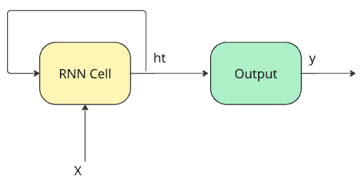
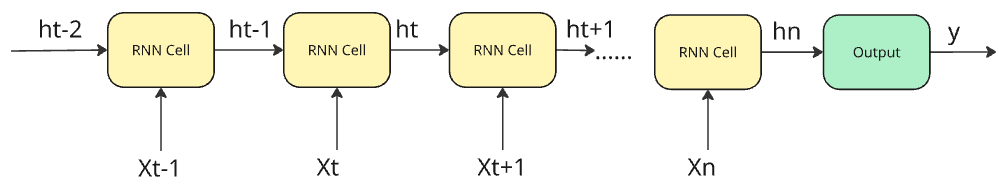

# Clear RNN Implementation

## Overview

This directory contains a simple, clear implementation of a Vanilla Recurrent Neural Network (RNN) from scratch using only NumPy. The goal is to provide an educational resource for understanding the core mechanics of RNNs, including the forward pass, Backpropagation Through Time (BPTT), and sampling for text generation, without relying on high-level libraries like PyTorch or TensorFlow.

The implementation is inspired by Andrej Karpathy's minimalist [`min-char-rnn.py`](https://gist.github.com/karpathy/d4dee566867f8291f086) gist, focusing on clarity and step-by-step logic.

## Dataset Used: Linux Manual Pages

Instead of the common Tiny Shakespeare dataset, this example uses a dataset compiled from various **Linux manual (man) pages** (`data/linux_man.txt`). The dataset is available on HuggingFace [here](https://huggingface.co/datasets/memorylost731/linux_man_pages_library)

**Why this dataset?**
*   **Structure:** Man pages have a distinct structure (sections like NAME, SYNOPSIS, DESCRIPTION, OPTIONS, EXAMPLES), specific formatting conventions (indentation, flags like `-h`, `--help`), and technical language.
*   **Challenge:** This structure provides a good challenge for a character-level RNN to learn syntax, formatting, and potentially common command patterns.
*   **Comparison:** It serves as an interesting base for future comparisons with more advanced architectures like LSTMs and GRUs, which might be better at capturing the longer-range dependencies often found in documentation or code-like text.
*   **Relevance:** For those interested in systems or cybersecurity, generating text that mimics man pages can be both educational and amusing.

## File Structure

*   `model.py`: Contains the `RNN` class, encapsulating the model parameters (weights, biases), Adagrad memory, the forward/backward logic (`_loss_fun`), the sampling method (`sample`), and the training step logic (`train_step`).
*   `example_text_generation.py`: Handles data loading, preprocessing (character mapping), setting up the training loop, calling the model's training and sampling methods, and printing progress.
*   `data/`: This directory should contain the dataset file (e.g., `linux_man.txt`).

## How to Run

1.  Ensure you have Python 3 and NumPy installed (`pip install numpy`).
2.  Run the training script from the terminal within the `clean_rnn` directory:
    ```bash
    python example_text_generation.py
    ```
3.  The script will load the data, initialize the model, and start training. It will periodically print the smoothed loss and generate sample text based on the model's current state.

## Key Concepts & Notes

Here's a refresher on Vanilla RNNs:

RNN diagram (folded)


RNN: steps unfolded


1.  **What it is:** A type of neural network with **internal loops** (recurrent connections). This loop allows information from previous steps in a sequence to persist and influence the processing of the current step. It maintains a hidden state (`h_t`) that acts as its "memory".

2.  **Why it's a step from MLP:** MLPs process fixed-size inputs independently. RNNs are designed for **sequential data** (like text or time series) where the order matters. The recurrent connection allows them to handle variable-length sequences and capture **temporal dependencies** that MLPs cannot inherently grasp.

3.  **What it's used for:** Processing sequential data. Classic examples include:
    *   Natural Language Processing (character/word-level language modeling, basic translation)
    *   Speech Recognition (modeling phoneme sequences)
    *   Time Series Prediction

4.  **Problems/Challenges (Vanilla RNN):**
    *   **Vanishing Gradients:** The biggest issue. During backpropagation through time, gradients can shrink exponentially, making it very hard for the network to learn dependencies between steps that are far apart (long-range dependencies).
    *   **Exploding Gradients:** Gradients can also grow exponentially large, destabilizing training (though often manageable with gradient clipping).
    *   **Sequential Computation:** Processing must happen one step at a time, limiting parallelization during training and inference compared to feedforward networks or Transformers.

Essentially, vanilla RNNs introduced the core idea of recurrence for sequence modeling but struggle significantly with learning patterns over long sequences due to the vanishing gradient problem. This led to the development of more complex variants like LSTMs and GRUs.

The main function of the RNN (**RNN cell**) is just this line:
```python
# ht = tanh(Wxh*xt + Whh*h_{t-1} + bh)
h = tanh(Wx @ X + Wh @ h_prev + b)
```

## Notes on Implementation Details

### Vanishing Gradient Problem

The vanishing gradient problem hinders the RNN's ability to learn long-range dependencies. In the code, this primarily manifests through two key calculations during backpropagation:

1. **Tanh Derivative:** The gradient calculation involves backpropagating through the tanh activation:
   ```python
   # dL/d(tanh_input) = dL/dh * (1 - h^2)
   dhraw = (1 - hs[t] * hs[t]) * dh
   ```
   Since the derivative (1 - tanh^2) is always between 0 and 1, multiplying by this term repeatedly across many time steps shrinks the gradient.

2. **Gradient Propagation Through Time:** The gradient from future steps (dhnext) is calculated using the hidden-to-hidden weights (Whh):
   ```python
   # dL/dh_{t-1} = dL/d(tanh_input) * d(tanh_input)/dh_{t-1}
   dhnext = np.dot(Whh.T, dhraw)
   ```
   This dhnext term, which carries the error signal back in time, is often small due to dhraw (point 1). When dhnext is calculated for the next step back in time (t-1), it involves another multiplication by Whh.T and another small tanh derivative. This repeated multiplication of the gradient signal by terms involving Whh.T and the tanh derivative causes the gradient to diminish exponentially as it flows further back in time.

When dhnext becomes very small (vanishes), the gradient update for earlier steps becomes negligible. It's as if the network "forgets" the influence of distant past inputs on the current output's error.

### Forgetting Past Inputs Quickly

This is a direct consequence of the vanishing gradient. As the gradient signal (dhnext) from distant past steps weakens, the updates to weights (Wxh, Whh) based on those early inputs become tiny. The model effectively cannot learn dependencies that span many time steps because the error information doesn't propagate back far enough.

### Adaptive Gradient (Adagrad)

Instead of vanilla Stochastic Gradient Descent (SGD), this implementation uses Adagrad for parameter updates.

```python
# Adagrad update: param += -learning_rate * grad / sqrt(mem + 1e-8)
for param, dparam, mem in zip([Wxh, Whh, Why, bh, by],
                            [dWxh, dWhh, dWhy, dbh, dby],
                            [mWxh, mWhh, mWhy, mbh, mby]):
    mem += dparam * dparam # Accumulate squared gradients
    # Update using element-wise division by sqrt of accumulated squares
    param += -learning_rate * dparam / np.sqrt(mem + 1e-8)
```

**How it works:**
- It maintains a per-parameter memory (mem) that accumulates the squares of gradients over time.
- The learning rate for each parameter is effectively scaled down by the square root of this accumulated value.

**Benefits:** Parameters that receive large gradients have their effective learning rate reduced, while parameters with small gradients have their learning rate reduced less. This adaptive learning rate can help stabilize training and often performs better than plain SGD, especially in scenarios with sparse gradients. It also implicitly incorporates a form of learning rate decay.

**Alternatives:** Other adaptive optimizers like RMSprop or Adam are also commonly used and often preferred over Adagrad in modern deep learning.

### Gradient Clipping

I also use Gradient Clipping to prevent the exploding gradient problem:

```python
np.clip(dparam, -5, 5, out=dparam)
```

This simply caps the maximum and minimum values of the gradients before the parameter update, preventing excessively large steps that could destabilize training.

### Weight Initialization

Weights are initialized from a standard normal distribution but scaled down by 0.01:

```python
Wxh = np.random.randn(hidden_size, vocab_size) * 0.01
```

**Why?** Starting with very small weights helps mitigate the risk of exploding gradients early in training. While standard normalization (zero mean, unit variance) is good, ensuring the initial weights are small can prevent the activations and gradients from immediately becoming too large, especially in recurrent networks where values are repeatedly multiplied.

## Diving Deeper & Next Steps

I strongly encourage you to clone this repository, run the `example_text_generation.py` script, and experiment! Try changing hyperparameters like `hidden_size`, `seq_length`, or `learning_rate` and observe how the training dynamics and the quality of the generated sample text change. Reading the commented code in `model.py` and `example_text_generation.py` alongside the concepts explained here is the best way to solidify your understanding.

This vanilla RNN implementation serves as a foundational step. While powerful for introducing recurrence, its limitations (especially the vanishing gradient problem) become apparent when dealing with longer sequences.

**What's Next in the `clear_neural_networks` Series?**

The natural progression from here is to tackle these limitations! The next implementation in this series will focus on:

*   **LSTM (Long Short-Term Memory):** Introducing gates (input, forget, output) and a dedicated cell state to explicitly manage information flow and overcome the vanishing gradient problem, enabling the learning of much longer-range dependencies.

Stay tuned for that!

## Contributing & Feedback

This project is for learning and sharing! If you find any bugs, have suggestions for improving clarity, or want to contribute in any way, please feel free to open an issue or submit a pull request on the main repository. Your feedback is highly valuable!

---

I hope this clear RNN implementation helps you build a solid foundation in sequence modeling. Happy learning and happy coding! 😊